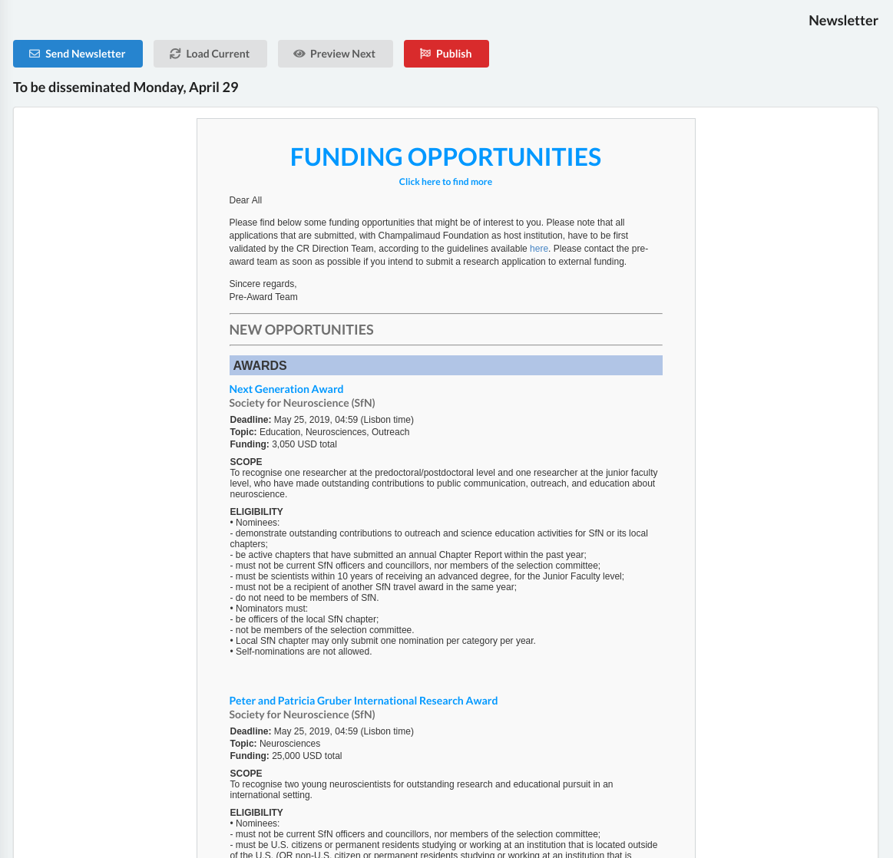

# Champalimaud Core Newsletter For Funding Oportunities

This is a standalone script which aims at automatically disseminating oportunities from core in the format of a newsletter.
disseminação de oportunidades de forma automática a partir do core, no formato de newsletter

## Setting environment

	# Set up research core project with Django

## Run

	python manage.py runserver

	
	

